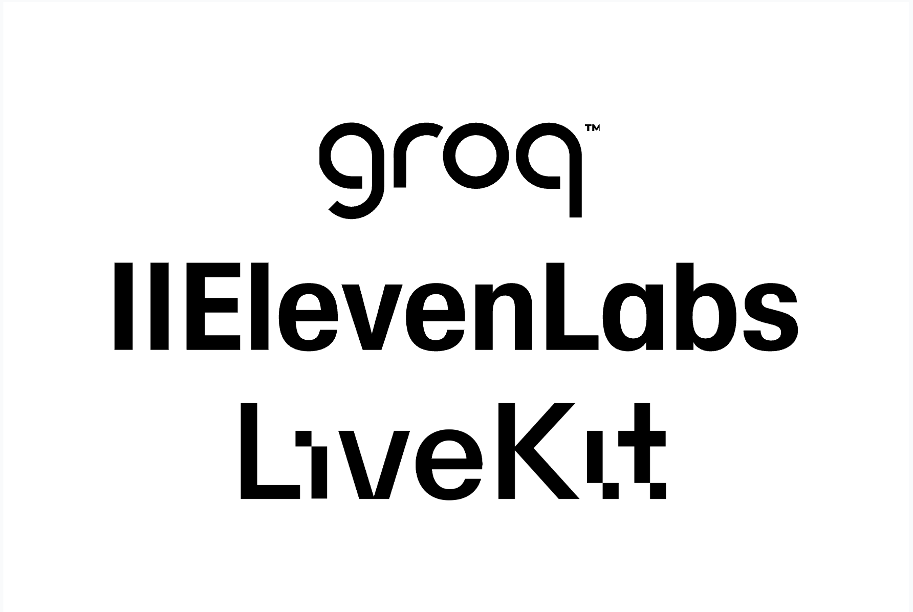
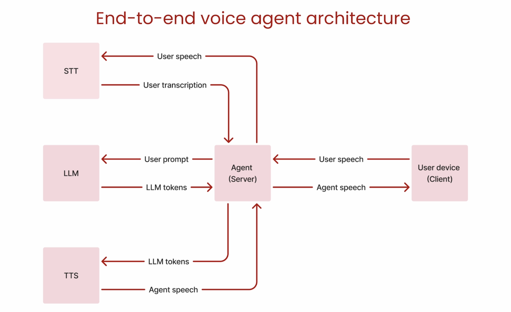
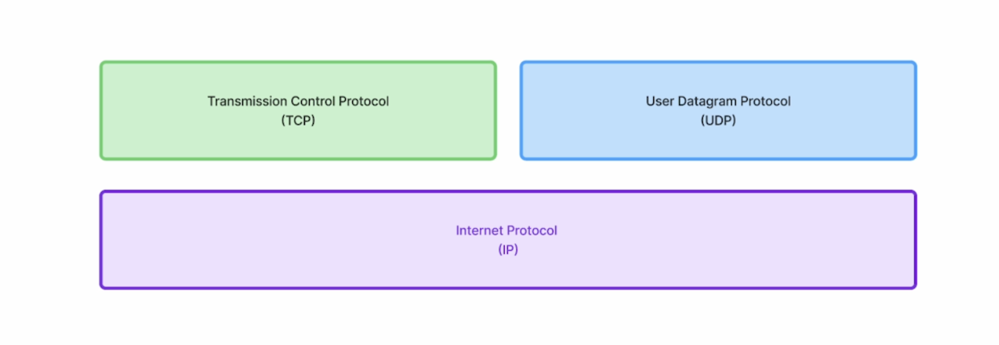

# Voice Agent using LiveKit, ElevenLabs, and Groq

Voice Agents combine the **speech and reasoning abilities of foundation models** to deliver **real-time, human-like voice interactions**.

### **Use Cases**

* **Personalized Learning:** Guide skill development, conduct mock interviews.
* **Customer Service:** Handle calls for restaurant booking, sales, insurance, etc.
* **Accessibility & Healthcare:** Power voice interfaces for medical and therapy applications.

### **Unique Challenges**

* **Speech & Text Artifacts:** Errors may occur in ASR/TTS or due to imperfect VAD/EOU handling.
* **Multilingual Performance:** Non-English ASR tends to lag behind English in accuracy.

---

## **About LiveKit**

* **Open-source (Apache 2.0)** project for building realtime voice and video applications using WebRTC.
* Solves many of WebRTC's real-time streaming challenges.
* Provides an **end-to-end framework for building voice AI agents**, easier than managing HTTP/WebSocket/WebRTC separately.
* Simplifies scaling real-time audio pipelines.

---

## **Architecture and Core Components**

| **Component**                                                 | **Description**                                                                                                   |
| ------------------------------------------------------------- | ----------------------------------------------------------------------------------------------------------------- |
| **VAD (Voice Activity Detection)**                            | Detects when a person starts/stops speaking. Reduces hallucination and cost by sending audio only when necessary. |
| **EOU (End of Utterance Detection)**                          | Determines when a speaker has finished their turn.                                                                |
| **ASR / STT (Automatic Speech Recognition / Speech-to-Text)** | Transcribes spoken audio into text.                                                                               |
| **LLM (Large Language Model)**                                | Generates text-based responses from the transcribed input. This layer can include content filtering.              |
| **TTS (Text-to-Speech / Speech Synthesis)**                   | Converts LLM-generated text into natural, spoken voice.                                                           |

### **VAD (Voice Activity Detection)**

* Sends audio to STT only when someone is speaking.
* Reduces hallucinations from the STT layer.
* Lowers system costs significantly.

### **STT (Speech-to-Text)**

* Converts spoken language into text.
* Decide which languages to support.
* Optionally use specialized models for phone calls or noisy environments.

### **LLM (Large Language Model)**

* Generates a response based on the transcribed input.
* This is the layer to apply content filtering or context customization.

### **TTS (Text-to-Speech)**

* Converts text responses back to natural-sounding speech.
* Choose appropriate voices, accents, or apply pronunciation overrides.

---

## **Latency Optimization**
  * Hard to measure accurately (client vs server latency).
  * **LiveKit** helps reduce networking latency.
  * LLM inference is often the main latency contributor.

**Optimization strategies:**
  * Use smaller/quantized models for faster response.
  * Consider provider-specific limits if using APIs.
  * Prompt the LLM for shorter, more concise replies.

---

## **Network Protocol Stack Overview**

| **Protocol**                            | **Layer**       | **Purpose**                                                                            |
| --------------------------------------- | --------------- | -------------------------------------------------------------------------------------- |
| **IP (Internet Protocol)**              | Network Layer   | Handles addressing and routing of packets.                                             |
| **TCP (Transmission Control Protocol)** | Transport Layer | Provides reliable, ordered communication.                                              |
| **UDP (User Datagram Protocol)**        | Transport Layer | Offers low-latency, unordered delivery. Used for real-time media like audio and video. |

---

## **Communication Methods**

### **HTTP**

* Built on TCP.
* Stateless, request/response cycle.
* Not optimized for real-time audio streaming.

### **WebSocket**

* Built on TCP.
* Full-duplex, persistent connection.
* **Limitation:** Not designed for streaming audio with low latency.

### **WebRTC**

* Built on UDP.
* Enables real-time audio, video, and data sharing.
* **Features:**

  * Congestion control
  * Data compression
  * Automatic packet timestamps
* **Drawbacks:**

  * Complexity
  * Scaling challenges

---

## **About LiveKit**

* **Open-source (Apache 2.0)**
* Solves many of WebRTC's real-time streaming challenges.
* Provides an **end-to-end framework for building voice AI agents**, easier than managing HTTP/WebSocket/WebRTC separately.
* Simplifies scaling real-time audio pipelines.

---

## **System Design Trade-offs**

| **Aspect**  | **Considerations**                                                         |
| ----------- | -------------------------------------------------------------------------- |
| **Latency** | Pipeline adds steps but allows optimizations per layer.                    |
| **Quality** | Pipeline gives you control over models and fine-tuning.                    |
| **Cost**    | VAD reduces cost by filtering silence. Smaller models reduce LLM expenses. |

---

## **Summary**

This repository provides a **modular, scalable framework for building real-time voice agents** using:

* **LiveKit** (Real-time audio/video)
* **Groq** (LLM + Whisper STT acceleration)
* **ElevenLabs** (TTS)

---

Would you like me to help you add installation instructions, diagrams, or code usage examples next?
